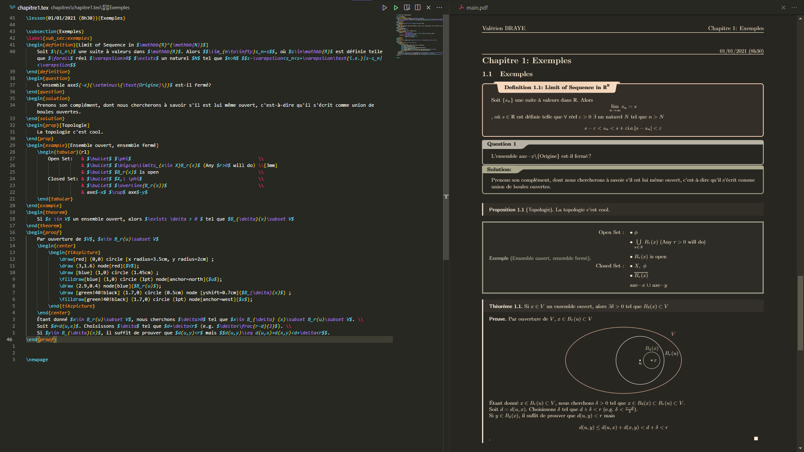
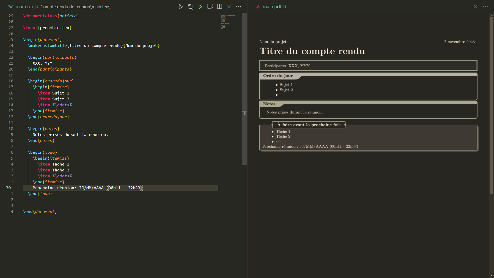
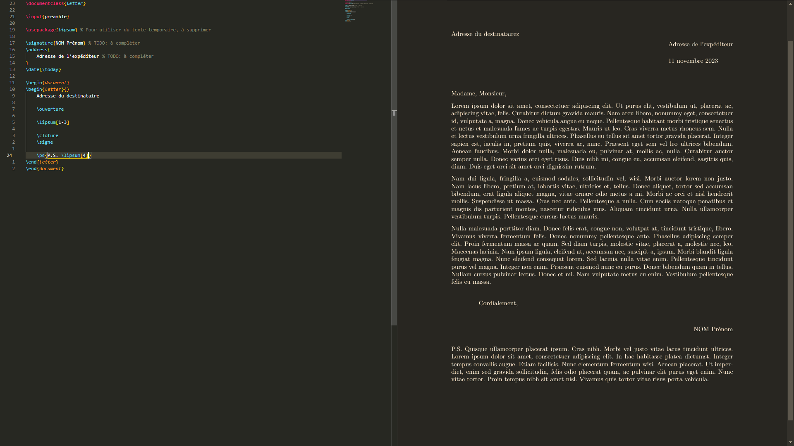
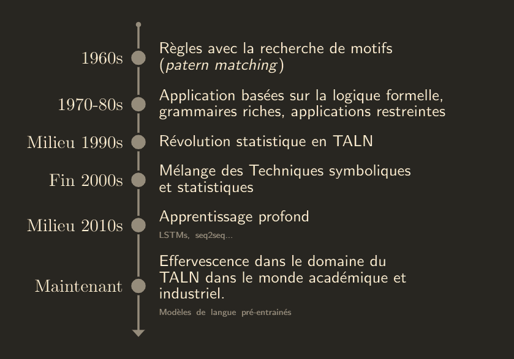
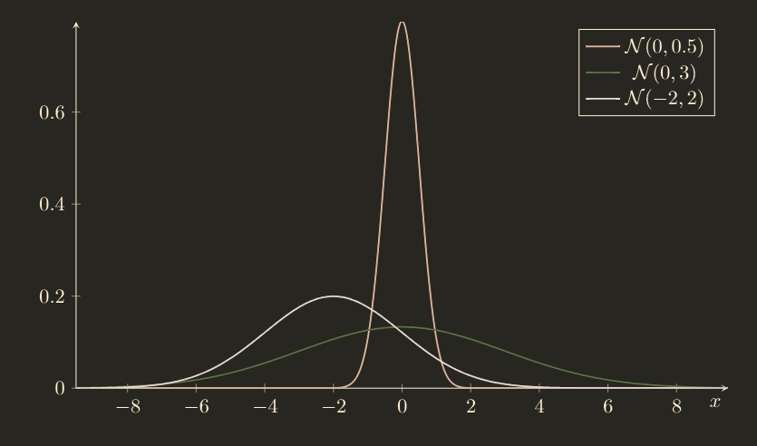
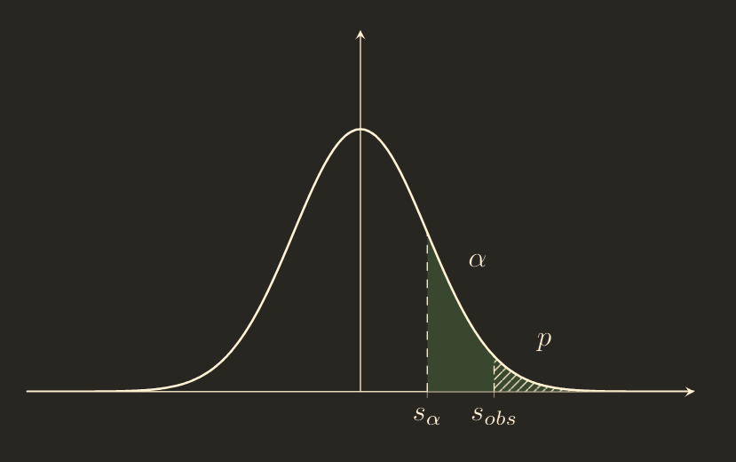
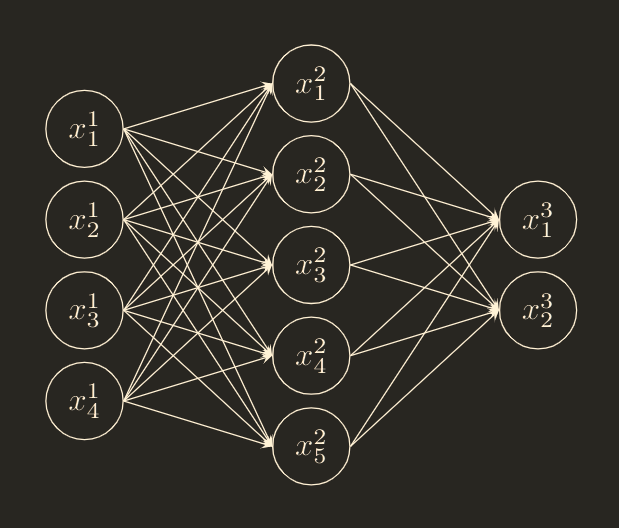

    <b>BEWARE: FRENCH REPOSITORY!</b>  
    This repository gathers useful LaTeX templates, but all of them are in French. If you are interested in an English version of the repository and the templates, feel free to open an issue or contact me.

---

# FR-LaTeX-templates
Ce répertoire rassemble des modèles de documents, figures et codes LaTeX qui me sont souvent utiles:
1. [Notes de cours](#notes-de-cours)
1. [Compte rendu de réunion](#compte-rendu-de-réunion)
1. [Lettre formelle](#lettre-formelle)
1. [Schémas Tikz](#tikz)
    1. [Ligne temporelle](#ligne-temporelle)
    1. [Graphique de lois normales](#graphique-représentant-des-lois-normales)
    1. [p-valeur](#p-valeur)

## Notes de cours

Modèle de document le plus complet, fournissant notamment:
- une page de garde et une introduction au cours clairs
- la mise en page automatique des chapitres
- une table des matières personnalisée
- de nombreux environnements pour questions, solutions, théorèmes, preuves, définitions, remarques, notes...
- des commandes personnalisée pour ajouter des chapitres, des images, des figures, des multi-colonnes...
- une bibliographie utilisant `bibtex`

Ce modèle est utile pour la prise de notes d'un cours pendant une session entière. Les chapitres sont séparés dans différents fichiers `.tex` pour réduire le temps de compilation et organiser les notes. Les chapitres sont ensuite inclus dans le fichier principal et la commande `\lesson` met automatiquement en page les débuts de chapitres.
Ce modèle reste lourd et le long préambule rend le temps de compilation non négligeable (autour de 15 secondes pour un petit chapitre), il ne convient donc pas à tous les usages.

Ce modèle est adapté du modèle [Charlie's Math Template](https://github.com/SeniorMars/dotfiles/tree/5b39b3ef545fa41361dfe64a2cbc03d8411a808f/latex_template) par [@SeniorMars](https://github.com/SeniorMars/).

## Compte rendu de réunion

Ce modèle est un dérivé du modèle de prise de notes de cours, ne conservant que les fonctionnalités utiles:
- la commande `\makecustomtitle` pour automatiquement formater le titre avec la date et le nom du projet.
- des environnements personnalisés pour les participants, l'ordre du jour, les notes de réunion...

Ce modèle est utile pour prendre les notes d'une réunion et est destiné à être réutilisé d'une réunion à l'autre.
Quatre environnements sont en à remplir:
- participants
- ordre du jour
- notes
- tâches à faires

Ce modèle est relativement léger et permet de compiler le document pendant la prise de notes sans perdre de temps (environ 3 secondes).

## Lettre formelle

Modèle destiné à l'écriture de lettres formelles (lettres aux administrations, lettres de motivation...) et ne définit donc que les commandes utiles à ce type de documents. Voici ses caractéristiques:
- mise en page classique des lettres formelles
- des commandes pour les formules de politesse (salutations et clôture), avec des valeurs par défaut
- `\signe` permettant d'ajouter une signature

Le modèle est minimaliste mais permet de rédiger une lettre rapidement sans besoin de manipuler un nombre trop importants de commandes.

## Schémas Tikz
Le répertoire [Tikz](./Tikz/) contient des schémas créés en utilisant le package Tikz. Le code de chacun des schémas est aisément modifiable pour pouvoir les adapter aux besoins du moment.

### Ligne temporelle

### Graphique représentant des lois normales
Ce graphique utilise également le package pgfplots.

### p-valeur
Ce graphique utilise également le package pgfplots.

### p-valeur
Un perceptron multicouches (réseau de neurones feedforward) à 3 couches, dessinable avec la commande `\fnn`, qui prend en arguments la taille des couches. Pour changer le nombre de couche, il faut changer la définition de cette commande, ce qui relativement aisé pour un nombre de couches connu à l'avance.

---
**Note:** les captures d'écrans ci-dessus ne montrent pas les vraies couleurs des pdf générés (le viewer pdf applique un filtre).